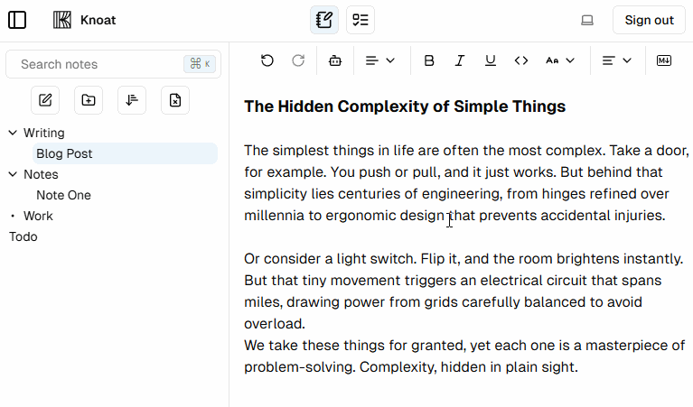

# Knoat

Note and Todo app with offline and local backups, AI integration.

## Features

### Offline and Local Sync

You can create notes and todos without any internet. They get saved locally, and the next time you are connected to the internet, the local backup will be pushed to the database.

### Notes

Drag and drop notes and directories to organize your notes

>Next feature to be added is collaboration mode - write notes with someone else in real time.

### AI Integration

Write a prompt to have text added to your note

Or highlight existing text to be rewritten in the style of your choosing

### Todos

Todo list drag and drop with "Completed" list

>Next feature to be added is email notifications for todos

